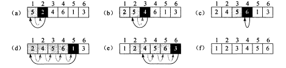

# 插入排序

插入排序对数组的所有元素进行遍历，每遍历到一个元素，将它与前一个元素进行比较，如果小于前一个元素，将它与前一个元素交换，继续比较，直到移到正确的位置。



```go
// InsertionSort O(n^2)
func InsertionSort(A []int) {
	for j := 1; j < len(A); j++ {
		key, i := A[j], j-1
		for i >= 0 && A[i] > key {
			A[i+1] = A[i]
			i--
		}
		A[i+1] = key
	}
}
```

